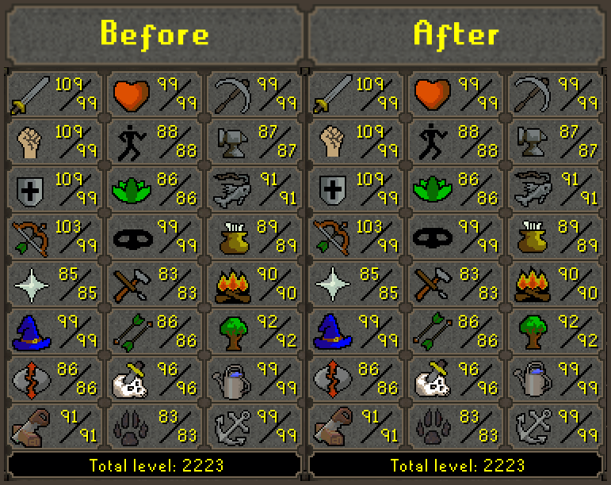

<h1 align="center">Center Skill Icons</h1>

A simple RuneLite plugin intended to fix the misalignment of icons on the skills panel, an issue exacerbated by the 
introduction of the sailing skill. The issue becomes more noticeable the lower the skill is on the skill panel.

    

## Future improvements

Even though the skill icons are anchored at the same coordinates with their frames, whitespace in
the icons themselves creates the illusion of misalignment or lopsidedness. With that being said, if there's demand, the 
main feature I'd consider adding is the ability for users to specify their own positions/offsets for each 
skill individually.